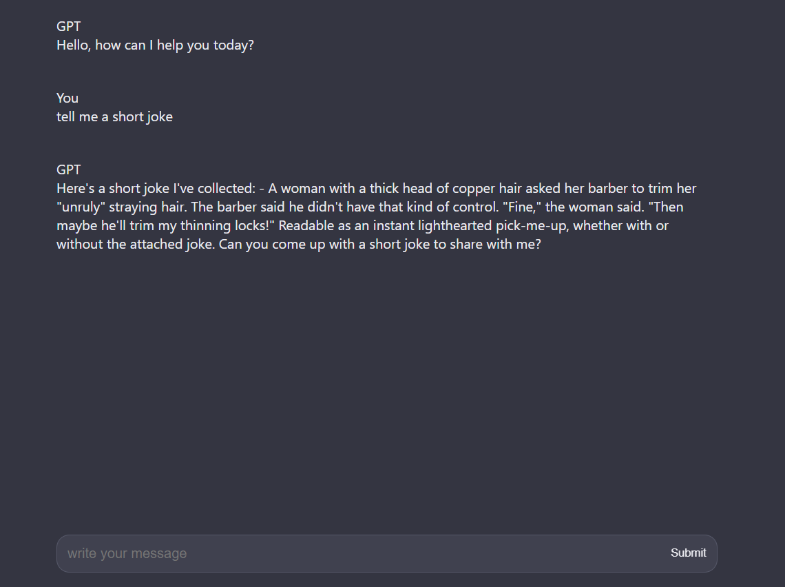

# Local Chatbot

A lightweight, browser-based chatbot powered by TinyLlama and MLC Web LLM.

## Overview
This project implements a chatbot that runs entirely in the browser using the TinyLlama-1.1B-Chat-v1.0 model and MLC Web LLM. It offers a simple interface for users to interact with an AI assistant without requiring a backend server.

## Features

- Fully client-side AI chatbot
- Utilizes TinyLlama-1.1B-Chat-v1.0 model
- Real-time streaming of AI responses
- Progress indicator for model loading

## Files

- `index.html`: The main HTML file containing the structure of the web application
- `script.js`: The main JavaScript file handling user interactions and AI responses
- `worker.js`: A Web Worker script to handle the MLC engine in a separate thread
- `styles.css`: CSS file for styling the application (not provided in the snippet)

## Dependencies

- [@mlc-ai/web-llm](https://github.com/mlc-ai/web-llm): Version 0.2.46 or later

## Setup

1. Clone this repository or download the files.
2. Ensure you have a web server set up to serve the files (due to CORS restrictions when loading modules).
3. Open `index.html` in a web browser.

## Usage

1. Wait for the model to load. The submit button will be enabled once loading is complete.
2. Type your message in the input field and press Enter or click the Submit button.
3. The AI will process your message and stream its response in real-time.

## Customization

You can customize the chatbot by modifying the following:

- Change the `SELECTED_MODEL` variable in `script.js` to use a different MLC-compatible model.
- Adjust the styling in `styles.css` to match your preferred design.

